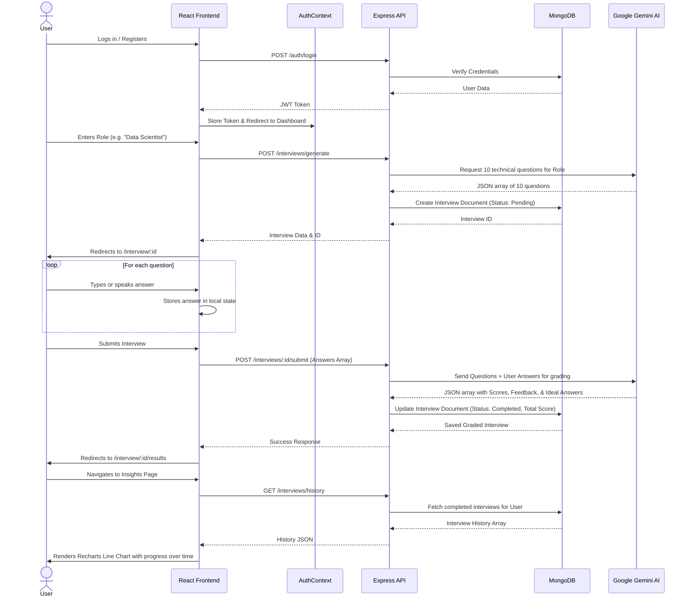

# HirePrep.AI

HirePrep.AI is an advanced, AI-powered mock interview platform designed to help candidates prepare for their next technical interview. By leveraging the power of Google's Gemini 2.5 API, HirePrep generates hyper-realistic, role-specific technical questions, evaluates user answers (both text and voice-transcribed), and provides strict, constructive feedback along with ideal answers to promote rapid improvement.

## 🚀 Tech Stack

The application is split into two primary architectures: a React-based frontend and an Express-based Node.js backend. 

### Frontend (`/HirePrep`)
- **React 19 & Vite**: Provides a lightning-fast development environment and modern component-based UI.
- **TypeScript**: Ensures type safety across components and API responses, reducing runtime errors.
- **Tailwind CSS (v4)**: Used for rapid UI development, implementing a "Hyper-minimalist Futurism" design aesthetic with glassmorphism, glowing accents, and dark modes.
- **React Router DOM**: Handles client-side routing between the Homepage, Dashboard, Interview Session, Results, and Insights pages.
- **Recharts**: Powers the `InsightsPage`, providing interactive data visualizations to track user improvement over time.
- **Lucide React**: Provides beautiful, consistent iconography across the platform.

### Backend (`/backend`)
- **Node.js & Express**: Serves as the robust, lightweight API layer handling requests from the React client.
- **TypeScript**: Maintains type parity with the frontend, defining strict schemas for interview sessions and user data.
- **MongoDB & Mongoose**: Used as the NoSQL database for flexible data storage. Stores User profiles and Interview session histories.
- **JSON Web Tokens (JWT)**: Handles stateless user authentication, securing endpoints and protecting interview data.
- **Google Gemini SDK**: Integrates with the Gemini 2.5 API to dynamically generate questions and evaluate candidate responses based on strict system prompts.

---

## ⚙️ Application Workflow & Architecture

The following Mermaid diagram illustrates the complete user journey and data flow through the application:

---

## 📂 Project Structure Explained

### `/backend`
- **`src/models/`**: Mongoose schemas. `User.ts` handles auth data, and `Interview.ts` stores the generated questions, candidate answers, and AI grading.
- **`src/controllers/`**: The logic bridge between routes and services. Extracts request data and formats responses.
- **`src/services/`**: The core business logic.
  - `aiService.ts`: Constructs prompt parameters and interfaces directly with the Gemini API to format JSON responses.
  - `interviewService.ts`: Handles the database logic (creating interviews, saving scores).
- **`src/middleware/`**: Contains `auth.ts`, which intercepts incoming requests to verify the JWT token before allowing access to protected routes.

### `/HirePrep` (Frontend)
- **`src/context/AuthContext.tsx`**: A global state provider that wraps the app, managing the JWT token in `localStorage` and automatically appending the `Authorization` header to Axios requests.
- **`src/services/api.ts`**: The Axios instance configured to communicate with the Express backend.
- **`src/pages/`**:
  - `Homepage.tsx`: The landing page outlining features, adapting its CTA based on authentication state.
  - `DashboardPage.tsx`: Where users define the role they want to practice for and initiate the interview generation.
  - `InterviewSessionPage.tsx`: The interactive UI where candidates go through the questions one by one.
  - `InterviewResultsPage.tsx`: Renders the detailed AI feedback and ideal answers for review.
  - `InsightsPage.tsx`: Renders the `recharts` graph to visualize scoring trends.

---

## 🚀 How to Run Locally

1. **Clone the repository.**
2. **Setup the Backend:**
   - Navigate to `/backend`.
   - Run `npm install`.
   - Create a `.env` file containing your `MONGO_URI`, `JWT_SECRET`, and `GEMINI_API_KEY`.
   - Run `npm run dev` to start the Express server on port 5000.
3. **Setup the Frontend:**
   - Navigate to `/HirePrep`.
   - Run `npm install`.
   - Run `npm run dev` to start the Vite development server.
4. **Access the App:** Open your browser and navigate to the localhost port provided by Vite.
